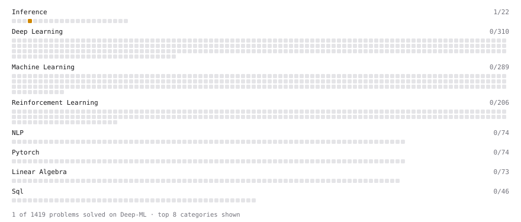

# Deep-ML

My machine learning practice from [Deep-ML](https://www.deep-ml.com). Every solution here was written by hand.

**15** solved · 15 problems · 0 labs · 0 math

[**Browse the interactive portfolio**](https://sahelib25.github.io/deep-ml/) to replay this filling in over time.

## Problems

| | Difficulty | Solved | |
| --- | --- | --- | --- |
| [Add a Bias Vector to a Batch via Broadcasting](https://www.deep-ml.com/problems/882) | easy | 2026-09-10 | [solution](problems/0882-add-a-bias-vector-to-a-batch-via-broadcasting) |
| [Calculate Mean by Row or Column](https://www.deep-ml.com/problems/4) | easy | 2026-08-16 | [solution](problems/0004-calculate-mean-by-row-or-column) |
| [Compute a Gradient with PyTorch Autograd](https://www.deep-ml.com/problems/884) | easy | 2026-09-11 | [solution](problems/0884-compute-a-gradient-with-pytorch-autograd) |
| [Compute Arithmetic Intensity and Classify Bottleneck](https://www.deep-ml.com/problems/414) | easy | 2026-08-11 | [solution](problems/0414-compute-arithmetic-intensity-and-classify-bottleneck) |
| [Create a Float Tensor from a Python List](https://www.deep-ml.com/problems/880) | easy | 2026-09-10 | [solution](problems/0880-create-a-float-tensor-from-a-python-list) |
| [Implement a Linear Layer Forward Pass with Matrix Multiplication](https://www.deep-ml.com/problems/883) | easy | 2026-09-10 | [solution](problems/0883-implement-a-linear-layer-forward-pass-with-matrix-multiplication) |
| [Matrix-Vector Dot Product](https://www.deep-ml.com/problems/1) | easy | 2026-08-12 | [solution](problems/0001-matrix-vector-dot-product) |
| [Reshape and Transpose a Tensor](https://www.deep-ml.com/problems/881) | easy | 2026-09-10 | [solution](problems/0881-reshape-and-transpose-a-tensor) |
| [Reshape Matrix](https://www.deep-ml.com/problems/3) | easy | 2026-08-16 | [solution](problems/0003-reshape-matrix) |
| [Scalar Multiplication of a Matrix](https://www.deep-ml.com/problems/5) | easy | 2026-09-21 | [solution](problems/0005-scalar-multiplication-of-a-matrix) |
| [Transpose of a Matrix](https://www.deep-ml.com/problems/2) | easy | 2026-08-16 | [solution](problems/0002-transpose-of-a-matrix) |
| [Build Scaled Dot-Product Attention](https://www.deep-ml.com/problems/490) | medium | 2026-09-06 | [solution](problems/0490-build-scaled-dot-product-attention) |
| [Classify LLM Prefill vs Decode as Compute-Bound or Memory-Bound](https://www.deep-ml.com/problems/417) | medium | 2026-08-10 | [solution](problems/0417-classify-llm-prefill-vs-decode-as-compute-bound-or-memory-bound) |
| [Build a Transformer Encoder Layer](https://www.deep-ml.com/problems/491) | hard | 2026-09-08 | [solution](problems/0491-build-a-transformer-encoder-layer) |
| [Implement Multi-Head Attention](https://www.deep-ml.com/problems/94) | hard | 2026-08-12 | [solution](problems/0094-implement-multi-head-attention) |

---

_This file is regenerated by Deep-ML on every push._
